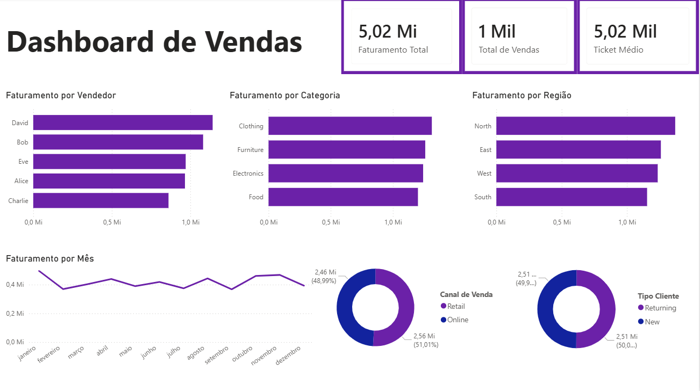

# Análise de Vendas

Análise exploratória de dados de vendas utilizando SQL e Power BI.

## Sobre o projeto

Dataset com 1.000 registros de vendas do ano de 2023, obtido no Kaggle.
Análise feita com MySQL e visualização no Power BI.

## Perguntas respondidas

- Qual o faturamento total?
- Qual vendedor teve melhor desempenho?
- Qual categoria de produto mais vendeu?
- Qual região gerou mais receita?
- Qual mês teve maior faturamento?
- Qual canal de venda é mais usado?
- Clientes novos ou recorrentes compram mais?
- Qual método de pagamento é mais comum?

## Ferramentas

## Dashboard

